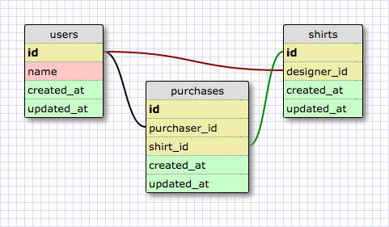

# Футболки

## Общие сведения
В этой задаче ты попрактикуешься с отношениями Sequelize.

*Рисунок 1*. Нормализованная схема для данной задачи (SQL вариант).

Схема, приведенная на рисунке является нормализованной. Про нормализацию ты можешь подробнее почитать в интернете. Простыми словами - разделение всех данных на атомарные единицы, которые ссылаются друг на друга по id, отсутствие дублирования данных. Такой вариант идеален для реляционных баз данных, в которых используется SQL.

В рамках этой задачи основное внимание уделяется написанию отношений, но давай представим, что ты создаешь полноценное приложение, которое позволяет пользователям создавать свой собственный дизайн футболки. Затем футболки с их дизайном будут доступны для покупки. Какой бы интерфейс ты сделал для такого приложения? Набросай его на бумаге - тебе будет проще проектировать свою БД.
	
После создания отношений, напиши методы моделей, которые будут отвечать на следующие вопросы:

*С точки зрения футболки ...*

1. Какой пользователь создал футболку?
2. В каких покупках участвовала футболка?
3. Какие пользователи купили футболку?

*С точки зрения пользователя ...*

1. Какие футболки создал пользователь?
2. Какие покупки сделал пользователь?
3. Какие футболки купил пользователь?
4. Какие пользователи разработали дизайн футболок, купленных пользователем?

*Если в твоём коде покупка - это отдельная модель(`Purchase`) ...*
*С точки зрения покупки ...*

1. Какой пользователь сделал покупку?
2. Какая футболка была куплена?

## Releases

### Пререлиз: Настройка
Убедись, что Sequelize установлен. Тебе предоставили необходимые модели. Без моделей `User` и `Shirt` не обойтись, а `Purchase` является опциональной.

### Релиз 0: Объявление  отношений
Для отношений каждой модели написаны тесты, предоставляющие комментарии по написанным отношениям (см. файлы в `spec/models/`). Если все тесты пройдены, то твои отношения написаны верно. Однако тесты заточены под определенную структуру, которая не является единственно верной. Поэтому если ты считаешь, что твоя структура подходит для решения данной задачи, но тесты не проходят, тогда можешь проконсультироваться с кем-нибудь из инструкторов.

### Релиз 1: Другие варианты
Подумай, как можно было спроектировать твою базу данных по-другому? Порисуй на листе бумаги варианты моделей, их взаимоотношений, подумай в каких случаях твой вариант работает хорошо, а в каких нужно сделать по-другому? Важно, чтобы вы могли легко получать все необходимые данные из вашей БД.

## Заключение
В рамках этой задачи стояла цель поработать со связыванием нескольких моделей между собой. Также важными частями задания являются: рассмотрение нескольких различных вариантов структуры БД, обоснованный выбор одной из них на основании каких-либо определенных умозаключений, информации из интернета и т.д. После завершения задания ты должен понимать, как составлять запросы.
